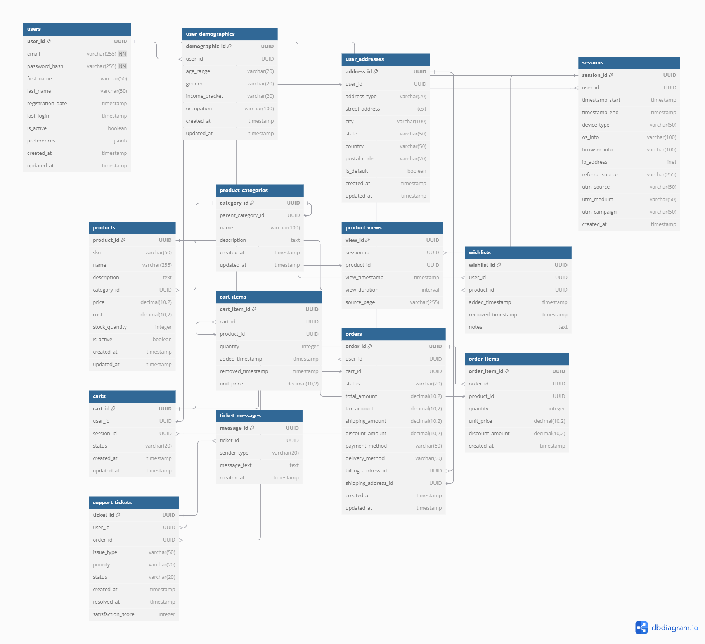

# E-commerce Analytics Platform

Real-time E-commerce Analytics Platform using Apache Kafka for streaming, AWS Glue for ETL, PostgreSQL and Redshift for storage, SageMaker for predictive modeling, and QuickSight for dashboards. Tracks customer behavior, analyzes purchases, predicts churn, and visualizes insights like user segmentation and conversion funnels.

## 🎯 Project Objectives
- Real-time customer behavior tracking and analysis
- Advanced sales performance analytics
- Customer segmentation and personalization
- Predictive analytics for churn and CLV
- Data-driven inventory management

## 📊 Database Schema

### Core Entities



### Key Relationships:
- Users can have multiple sessions
- Each order belongs to one user
- Products belong to categories
- Cart items reference products
- Support tickets linked to users and orders

## 🏗 Architecture Overview
![Architecture Diagram]

### Core Components
- **Data Collection**: Apache Kafka for event streaming
- **Storage**: PostgreSQL (transactional) & AWS Redshift (analytical)
- **Processing**: Stream processing with Kafka Streams
- **Analytics**: Machine Learning with AWS SageMaker
- **Visualization**: AWS QuickSight

## 🚀 Getting Started

### Prerequisites
- Docker & Docker Compose
- Python 3.9+
- AWS Account
- PostgreSQL 14+

### Local Development Setup
```bash
# Clone the repository
git clone https://github.com/yourusername/ecommerce-analytics.git
cd ecommerce-analytics

# Create virtual environment
python -m venv venv
source venv/bin/activate  # Linux/Mac
# or
.\venv\Scripts\activate  # Windows

# Install dependencies
pip install -r requirements.txt

# Start local infrastructure
docker-compose up -d
```

### Database Setup
```bash
# Initialize database
python scripts/init_database.py
```

## 📊 Data Generation

### Sample Data Generation
```bash
# Generate initial test data
python scripts/generate_data.py --users 1000 --days 30
```

### Real-time Event Simulation
```bash
# Start event simulator
python scripts/simulate_events.py --rate 10
```

## 🛠 Project Structure
```
ecommerce-analytics/
├── .github/workflows/          # CI/CD pipelines
├── data_generators/           # Data generation scripts
├── infrastructure/           # IaC & configuration
├── src/                    # Main source code
│   ├── stream_processors/  # Kafka processors
│   ├── models/            # ML models
│   ├── api/              # REST API
│   └── dashboard/       # Analytics frontend
├── scripts/            # Utility scripts
├── tests/             # Test suites
└── docs/             # Documentation
```

## 📖 Documentation

Detailed documentation is available in the `docs` directory:
- [Data Schema](docs/schema.md)
- [Event Types](docs/events.md)
- [Analytics Queries](docs/queries.md)
- [API Documentation](docs/api.md)

## 🔄 Development Workflow
1. Feature branches follow format: `feature/description`
2. PRs require passing tests and code review
3. Main branch is protected
4. CI/CD automatically deploys to staging

## 📈 Monitoring & Analytics
- Real-time metrics dashboard
- Performance monitoring
- Data quality checks
- Business KPI tracking

## 🤝 Contributing
See [CONTRIBUTING.md](CONTRIBUTING.md) for guidelines.

## 📝 License
This project is licensed under the MIT License - see [LICENSE](LICENSE) for details.


